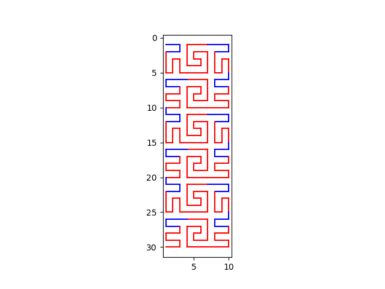
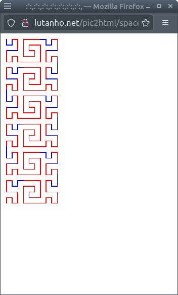

# py_draw_sfc
Python port of a spacing filling curve drawing function written in javascript

# What's this

A Python translation of this [spacing filling curve in javascript](http://lutanho.net/pic2html/draw_sfc.html).

The original `html` file is included in the repo, as the `spacefilling.html`.

The `go()` function is translated by using vim `:%s` commands to remove `{`, `}` and adjust the indents.

Manual changes include the for loops, the `Math.round()` functions.

# Existing issue

When width > 3/2 * height, or height > 3/2 * width, e.g.
`x=30, y=10`, the outputs don't match that from js functions. See screenshots below.

